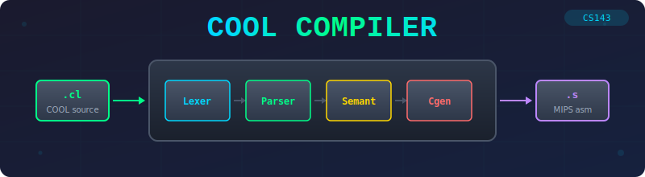
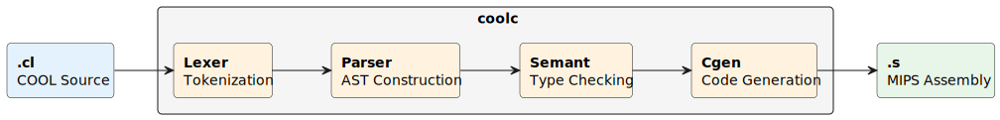

<p align="center">
  
</p>

<p align="center">
  <a href="LICENSE"></a>
  
  
  <a href="https://github.com/nikaltipar/cool-compiler/stargazers"></a>
  <a href="https://github.com/nikaltipar/cool-compiler/issues"></a>
</p>

<h1 align="center">COOL Compiler</h1>

A compiler for the <strong>COOL</strong> (Classroom Object-Oriented Language) programming language,
originally developed as part of the Stanford CS143 Compilers course,
now being restructured as a unified C++ project.

> **Note:** This repository is for educational experimentation with compilers. If you're taking CS143, please complete the assignments yourself — there's a lot to learn from doing it firsthand.

## What is COOL?

COOL is a small object-oriented language designed for teaching compiler construction. It includes:

- **Classes and Inheritance** — Single inheritance with a root `Object` class
- **Static Typing** — Compile-time type checking with `SELF_TYPE` support
- **Automatic Memory Management** — Optional garbage collection
- **Pattern Matching** — `case` expressions for runtime type dispatch

## Compilation Pipeline

<p align="center">
  
</p>

## Example COOL Program

```cool
class Main inherits IO {
    main() : Object {
        out_string("Hello, World!\n")
    };
};
```

## Built-in Classes

| Class | Description |
|-------|-------------|
| `Object` | Root class (`abort`, `type_name`, `copy`) |
| `IO` | I/O operations (`out_string`, `out_int`, `in_string`, `in_int`) |
| `Int` | 32-bit integers |
| `String` | Strings (`length`, `concat`, `substr`) |
| `Bool` | Boolean values |

## Features

- [x] **Lexical Analysis** — Tokenization, string/comment handling, error recovery
- [x] **Parsing** — Full COOL grammar with operator precedence
- [x] **Semantic Analysis** — Type inference, inheritance checking, scope management
- [x] **Code Generation** — MIPS assembly with:
  - Object layout and dispatch tables
  - Dynamic dispatch (virtual methods)
  - Static dispatch (`@Type.method()`)
  - Memory allocation and initialization
  - Case expressions (runtime type checking)
  - Optional garbage collection (generational/scanning)

## Runtime System

Generated code runs on SPIM with `trap.handler` providing:

- Heap allocation and memory management
- Garbage collection (when enabled)
- Built-in class implementations (String, IO, etc.)
- Runtime error handling (dispatch on void, case abort, etc.)

## License

**My code** is released under the [MIT License](LICENSE).

**Course materials** (skeleton code, headers) are Copyright © 1995-1996 The Regents of the University of California (see `include/copyright.hpp`).

**SPIM simulator** (`lib/trap.handler`) is Copyright © James R. Larus — personal/educational use only.
